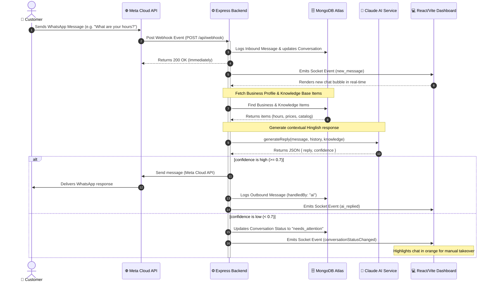
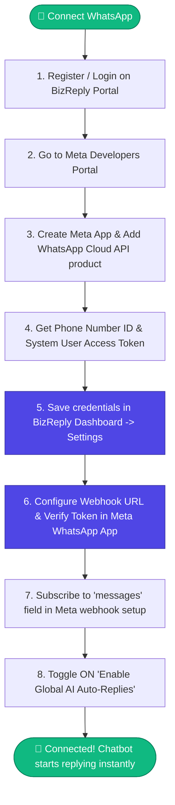

# BizReply - AI-Powered WhatsApp Chatbot for Businesses

BizReply is a premium, modern, multi-tenant WhatsApp automation SaaS platform built for local businesses. It utilizes the Meta WhatsApp Cloud API and Anthropic Claude AI to automatically answer customer queries based on a business's custom Knowledge Base (FAQs, Products, Services, Policies).

---

## 🏗️ System Architecture & Workflow

Here is a visual representation of how BizReply handles incoming customer messages, generates AI auto-replies, and updates the dashboard in real-time.



---

## 🔌 WhatsApp Connection & Webhook Setup Workflow

Follow this step-by-step flowchart to link your Meta WhatsApp Cloud API credentials to BizReply and configure incoming message webhooks:



### 📋 Setup & Verification Guide

1. **Get Meta Developer Details**:
   - Visit the [Meta for Developers](https://developers.facebook.com/) portal.
   - Setup a Business App, navigate to **WhatsApp** -> **API Setup**.
   - Copy the **Phone Number ID** (e.g., `1055598124991`) and generate a permanent **System User Access Token**.

2. **Save Settings in BizReply**:
   - Log into BizReply and navigate to [System Settings](file:///c:/Users/arunk/Desktop/BizReply/frontend/src/pages/Settings.tsx).
   - Enter your **WhatsApp Connected Number** (with country code), **Meta Phone ID**, and **Meta Cloud API Token**. Click **Save Settings**.

3. **Configure Webhook in Meta**:
   - In Meta Developers App, go to **WhatsApp** -> **Configuration**.
   - Set **Callback URL** to: `https://<your-backend-api-url>/api/webhook` (for local dev, use an ngrok or localtunnel URL pointing to port `5000` or `5088`).
   - Set **Verify Token** to the value of `META_WEBHOOK_VERIFY_TOKEN` (default is `your_custom_webhook_verify_token`).
   - **Click Verify and Save**.
   - Click **Manage Webhook Fields** and **Subscribe** to `messages`.

---

## 🌟 Key Features

1. **AI Auto-Responder (Hinglish/English)**:
   - Contextual understanding of customer queries using Claude-3-Haiku.
   - Built-in localized **Hinglish fallback responder** (e.g., *"Mujhe is baare mein abhi jankari nahi hai. Business owner se confirm karke aapko batata hoon."*) for low-confidence queries or offline modes.
2. **Real-time Live Chat Panel**:
   - Full live-chat dashboard using **Socket.io** to take over chats manually.
   - Distinct statuses: `active`, `needs_attention` (requires manual reply), and `resolved`.
3. **Flexible Knowledge Base**:
   - Manually insert items or upload bulk lists using an Excel/Spreadsheet parser.
4. **Pro Broadcast Campaigns**:
   - Send template/custom broadcasts to lists of phone numbers.
   - Outbox queue manager with automatic cron scheduling.
5. **Subscription Billing Gate**:
   - Multi-tier subscriptions (`free`, `starter`, `pro`) integrated with **Razorpay**.
   - Automatic limits gating on broadcasts based on tier.

---

## 🚀 Getting Started

### 🔌 Backend Setup

1. Navigate to the backend directory:
   ```bash
   cd backend
   ```
2. Install dependencies:
   ```bash
   npm install
   ```
3. Configure environment variables in `.env` (use `.env.example` as a template):
   ```env
   PORT=5000
   MONGO_URI=mongodb+srv://...
   JWT_SECRET=your_jwt_secret
   MOCK_SERVICES=true   # Set to 'false' to use real Anthropic & WhatsApp API endpoints
   ```
4. Run in development mode:
   ```bash
   npm run dev
   ```

### 💻 Frontend Setup

1. Navigate to the frontend directory:
   ```bash
   cd ../frontend
   ```
2. Install dependencies:
   ```bash
   npm install
   ```
3. Run the Vite development server:
   ```bash
   npm run dev
   ```

---

## 🛠️ Developer Utility Scripts

Located in `backend/scratch/`:

*   **Database connection check**:
    ```bash
    npx ts-node scratch/verify_db.ts
    ```
*   **Full API Endpoints & webhook workflow test**:
    ```bash
    npx ts-node scratch/verify_api_services.ts
    ```
*   **Manually update business subscription tier**:
    ```bash
    npx ts-node scratch/change_plan.ts <business_email> <free|starter|pro>
    ```

---

## 📝 Licence

Distributed under the ISC License. Created with ❤️ by Arun Kumar Bind.
